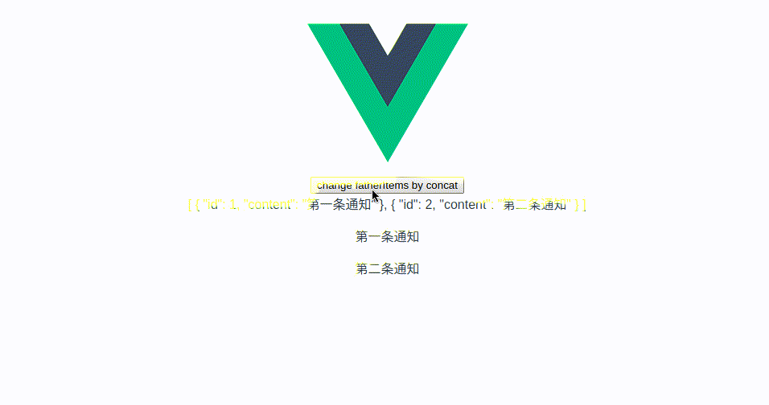

# demo项目复现问题流程

1. git clone 或者 下载zip

2. 在项目根目录下执行`npm install`

3. 执行`npm run serve`

4. 点击首页的`change fatherItems by concat`按钮

然后问题发生, 在children.vue中的v-for
```
<p v-for="item in childItems" :key="item.id">{{item.content}}</p>
```

不会主动刷新, 即使childItems已经更新(使用模板语法`{{childItems}}`事先窥探了数据是否更新)

# 个人排查结果,供参考:

和组件`Drawer`有关,在new-message.vue中注释掉Drawer组件的时候,则一切就会正常. 我翻了Drawer源码,太菜,没看出什么问题, 真心希望有更懂的前辈可以帮我解释问题发生的根源

# 下面是我的复现gif图

可以看到只有下面的v-for部分不会更新,只更新了上面的模板语句`{{childItems}}`部分

